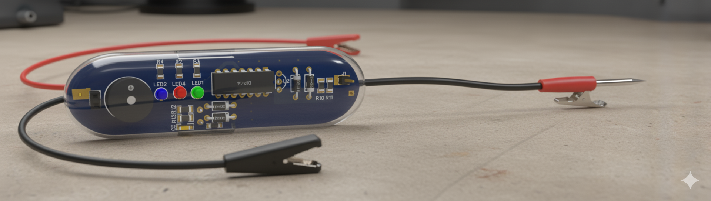

# logicprobe
# Logic Probe - Auto-Adaptive Digital Signal Detector



## Overview

A **minimal-component logic probe** that automatically adapts to both 3.3V and 5V digital systems. Built with only **13 components** around a single LM339 quad comparator, this design demonstrates elegant analog engineering principles while providing full logic analyzer functionality.

### Key Features
- **Auto-Adaptive**: Works seamlessly with 3.3V and 5V logic without switches or calibration
- **Minimal Design**: Complete functionality with just 13 components
- **Three-State Detection**: HIGH (Red LED), LOW (Green LED), PULSE (Blue LED + Buzzer)  
- **Self-Powered**: Takes power directly from target circuit
- **High Impedance Input**: >1MΩ input won't load sensitive circuits
- **Educational Focus**: Perfect for learning analog circuit fundamentals

## Technical Specifications

| Parameter | Value |
|-----------|-------|
| **Component Count** | 13 parts total |
| **Power Supply** | 3.3V - 5.5V (auto-adapts) |
| **Logic Thresholds** | 0.3×VCC (LOW), 0.7×VCC (HIGH) |
| **Input Impedance** | >1MΩ |
| **Response Time** | <100ns |
| **Current Draw** | <8mA |

## Circuit Architecture

The design uses **proportional voltage dividers** to create thresholds that automatically scale with supply voltage:

```
3.3V System: LOW < 1.0V, HIGH > 2.3V
5.0V System: LOW < 1.5V, HIGH > 3.5V
```

**Core Components:**
- **1× LM339** (Quad Comparator - main IC)
- **3× LEDs** (Visual indication)  
- **1× Buzzer** (Audio feedback)
- **4× Resistors** (Thresholds & current limiting)
- **3× Capacitors** (Decoupling & pulse shaping)
- **1× N-FET** (High-impedance input buffer)

## Project Files

```
logic-probe/
├── README.md                    # This file
├── block-diagram/
│   ├── system_block.pdf         # System architecture
│   └── system_block.png         # Block diagram image
├── schematic/      
│   └── logic_probe.png           # Circuit schematic
├── pcb/
│   ├── gerbers/                 # Manufacturing files
│   └── layout.png               # PCB layout
├── user-manual/
│   ├── assembly_guide.md        # Build instructions
│   ├── user_guide.md            # Operation manual
│   └── bom.md                   # Bill of materials
└── images/
    └── logic_probe.png           # Product
```

## Quick Start

1. **Build**: Follow `user-manual/assembly_guide.pdf`
2. **Connect**: Attach power leads to target circuit (3.3V or 5V)
3. **Probe**: Touch probe tip to digital signals
4. **Read**: 
   - 🟢 **Green LED** = Logic LOW
   - 🔴 **Red LED** = Logic HIGH  
   - 🔵 **Blue LED + Buzzer** = Pulse/Clock activity

## Applications

- **Digital Circuit Debugging**: Verify logic states at IC pins
- **Educational Labs**: Demonstrate comparator circuits and threshold detection
- **Clock Signal Detection**: Audio/visual indication of pulse activity
- **Logic Family Testing**: Compare TTL vs CMOS signal levels

## Educational Value

This project teaches:
- **Comparator Circuit Design**: LM339 configuration and biasing
- **Threshold Generation**: Voltage divider networks and proportional references
- **Auto-Adaptive Circuits**: Self-adjusting analog systems
- **Minimal Component Design**: Maximum functionality with minimum parts
- **Analog-Digital Interface**: Converting analog voltages to digital indications

Perfect for analog electronics courses and demonstrates that sophisticated functionality doesn't require complex circuitry.

## License

MIT License - Free for educational and personal use.

## Contributing

Contributions welcome! Please focus on:
- Educational documentation improvements
- Assembly guide clarifications  
- Application example additions
- PCB layout optimizations for student assembly

---

*"Elegant engineering achieves maximum functionality through intelligent simplicity, not component count."*
